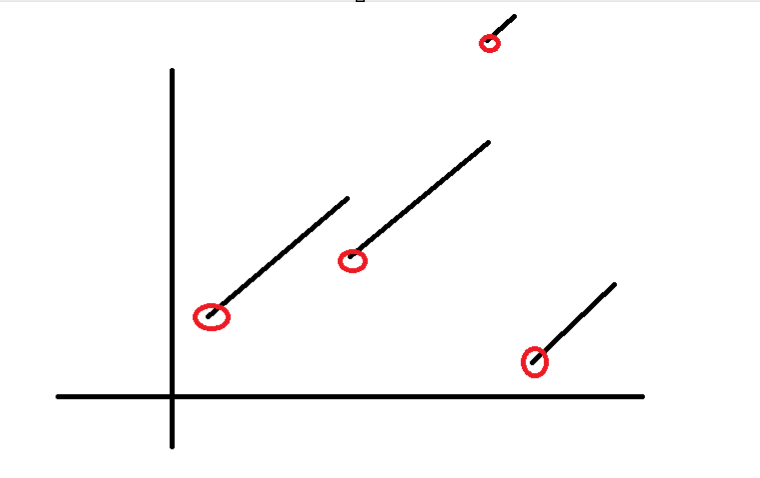

# Day 5

## Part 1

Nothing to report except that I had to use long instead of int because of the size of the numbers

## Part 2

I found really hard to find a solution. Obviously, applying the method of the firt part on all the seeds didn't work. Indeed in the first part my solution took about 3ms to solve the problem with 10 seeds. But with millions of seeds to treat, I coudn't make it.

The problem is classical : Finding a minimum of function. In our case the function takes as the input the million of seeds, and could be seen as composition of piecewise affine functions. 

seed-to-soil map:
50 98 2
52 50 48

could me modelized by f1(x) = x if (x between 0 and 49) or (x greater/equal than 100), f1(x) = x + 2 if x between 50 and 97, f(x) = x - 48 if x between 98 and 99.

soil-to-fertilizer map could be modelized by f2 which is also piecewise affine function. And so on. Furthermore :
1) the composition of piecewise affine functions is a piecewise affine functions. 
2) all these functions are piecwise increasing functions.

The idea was to find each of these red points that I called breaking points. I started from from the last function : humidity-to-location and computed their BP (here 0,56,93 and 97). Then I computed the BP of temperature-to-humidity which are the union of their own BP and the numbers such as temperature-to-humidity applied in these numbers gives the BP of humidity-to-location. That is to say BP(temperature-to-humidity) = sourcePoints(temperature-to-humidity) ∪ (temperature-to-humidity^(-1))(BP(humidity-to-location)). And so on until the seed-to-soil. Finally I managed to reduce the search space : I kept seeds that were in the BK of seed-to-soil. Took me a lot of time to come up with this idea but I enjoyed this problem.